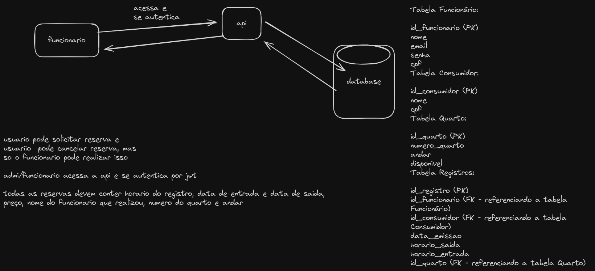

## Sobre 
Este projeto foi criado em Nestjs e typescript usando typeorm para uma API de reserva de hotel, e também está conteinerizado com o docker, e essa api permite um funcionario pode fazer uma reserva para um usuario, onde cada funcionario deve estar logado  ou se cadastrar ,e ter acesso ao sistema com token JWT, pode fazer crud de funcionario, cadastar novos usuarios, quartos e fazer as reservas do hotel que contem o nome do consumidor,funcionario, data da emissao, data de entrada e saida, numero e andar do quarto.

## Esquema

### para rodar com docker:

` docker compose up `

caso encontre algum problema relacionado a imagem do mysql
` docker start mysql `

` docker exec -it mysql mysql -u root -p `

` GRANT ALL PRIVILEGES ON *.* TO 'root'@'%' IDENTIFIED BY 'abc' WITH GRANT OPTION;
FLUSH PRIVILEGES; `

` CREATE DATABASE hotel; `

## Endpoints

`POST ` http://localhost:3000/funcionario/create

`GET ` http://localhost:3000/funcionario

`GET` http://localhost:3000/funcionario/:id

`PUT` http://localhost:3000/funcionario/update

`DELETE` http://localhost:3000/funcionario/delete/:id

`POST` http://localhost:3000/funcionario/login

`POST` http://localhost:3000/registro/create-consumer

`POST` http://localhost:3000/registro/create-quarto

`POST` http://localhost:3000/registro/create-reserva